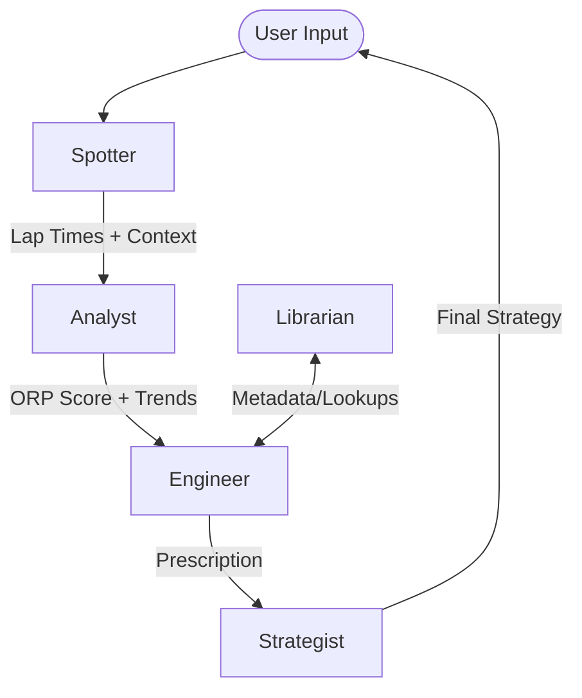

# Tech Spec: 5-Brain AI Orchestration

## Overview
A.P.E.X. V3 operates as a distributed system of 5 specialized AI "Brains". This spec defines the communication protocol and state management for this ensemble.

## The Distributed Brains
1. **The Strategist:** Logic for event trajectory and baseline selection.
2. **The Advisor/Engineer:** Physics-based mechanical prescriptions.
3. **The Spotter:** Live situational awareness and schedule monitoring.
4. **The Data Analyst:** ORP calculation and "Feel vs Real" auditing.
5. **The Librarian:** Setup retrieval and metadata integrity.

## Communication Protocol: "Chain of Custody"
Instead of a single prompt, data is passed between personas as a "Session Document".



### Session Document Schema (JSON)
```json
{
  "chain_id": "uuid",
  "current_owner": "analyst",
  "data": {
    "telemetry": { "laps": [], "consistency": 0.0 },
    "symptoms": ["bottoming", "loose-exit"],
    "prescriptions": [],
    "orc_metadata": { "track": "SDRC", "traction": "high" }
  },
  "audit_trail": [
    { "persona": "spotter", "timestamp": "...", "action": "Logged 12 laps" }
  ]
}
```

## Implementation Strategy
- **Service Layer:** `Execution/backend/services/orchestrator.py` handles the routing.
- **Persona Directives:** Each brain has a dedicated MD file in `Directives/prompts/`.
- **Statelessness:** The Orchestrator injects the relevant "Institutional Memory" into each persona's context before calling the LLM.

## Safety Gates
- **Confidence Check:** If the **Analyst** flags low data consistency (CoV > 15%), the **Engineer** is instructed to prioritize "Driver Practice" over "Setup Changes".
- **Scenario B Enforcement:** If the **Strategist** sets "Scenario B (Conservative)", the **Engineer** is restricted from recommending high-risk items (e.g., Suspension Geometry changes).
