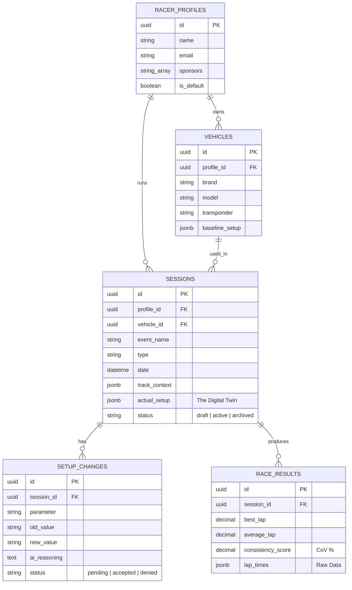

# Database Architecture: Entity Relationship Diagram (ERD)

## Key Architectural Decisions
1. **JSONB for Setups:** Chassis setups (26 parameters) are stored in `jsonb` to allow for schema flexibility between car brands while maintaining performance.
2. **UUIDs:** All Primary Keys use UUIDs to ensure no collisions during cross-regional syncing.
3. **Active Intelligence:** The `SETUP_CHANGES` table is specifically designed to feed the "Institutional Memory" loop by tracking *why* a change was made and whether it worked.
